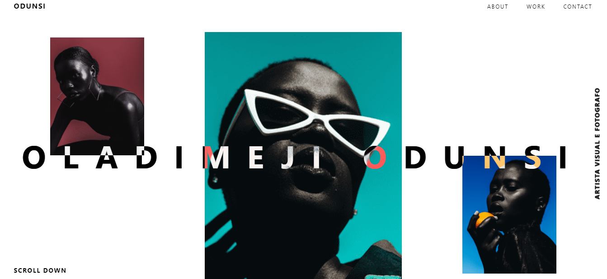

<h1 align="center">
    Oladimeji Odunsi
</h1>
<p align="center">Sitesimples desenvolvido utilizando Gatsby JS</p>

<p align="center">
	 <a href="https://oladimej-odunsi.netlify.app/">
    
  </a>
</p>

<p align="center">
	<kbd>
		
	</kbd>
</p>

🛠 Tecnologias
=================
As seguintes ferramentas foram usadas na construção do projeto:

- [Gatsby.js](https://www.gatsbyjs.com/)
- [SCSS](https://sass-lang.com/documentation/syntax)
- [GSAP Animations](https://greensock.com/gsap/)


## :information_source: Como rodar a aplicação

```bash
# Clone this repository
$ git clone https://github.com/aosilvajr/oladimej-odunsi.git

# Go into the repository
$ cd oladimej-odunsi

# Install dependencies
$ yarn install

# Build app
$ yarn build

# Run app
$ yarn start
```

## :memo: License
This project is under the MIT license. See the [LICENSE](https://github.com/aosilvajr/oladimej-odunsi/blob/master/LICENSE) for more information.

---
